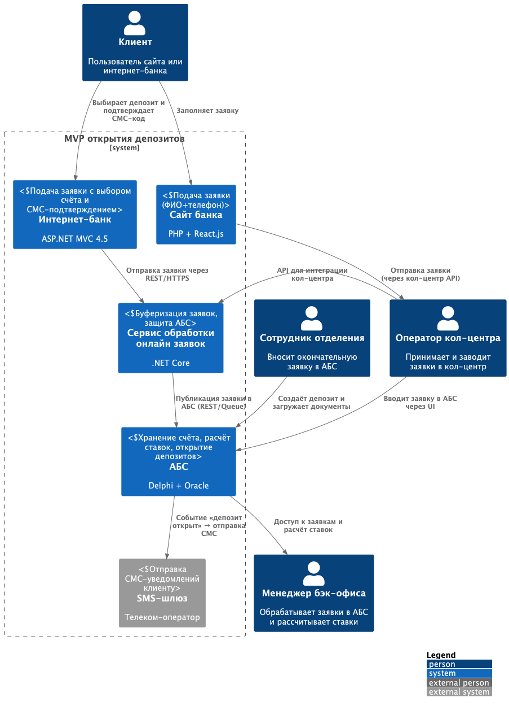
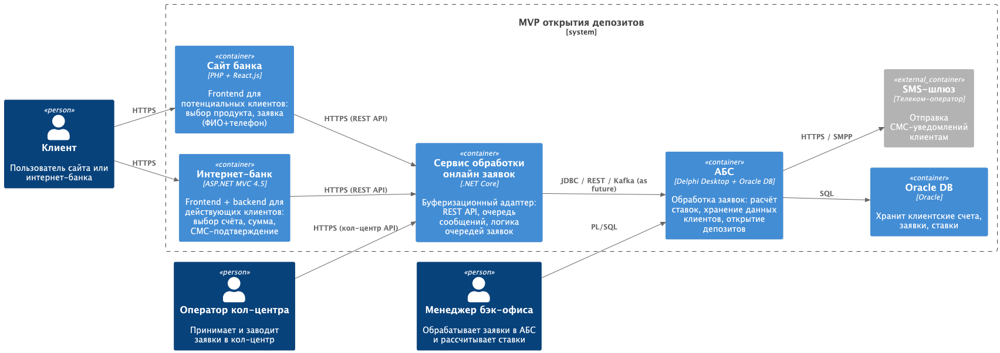

# ADR: Концептуальная архитектура MVP открытия депозитов

### Название задачи
Концептуальная архитектура MVP процесса открытия депозитов в интернет-банке и на сайте

### Автор
Павел Бредихин

### Дата
2025-05-29

---

## Функциональные требования (Use Cases)

| № | Действующие лица или системы          | Use Case                                   | Описание                                                                                           |
|:-:|---------------------------------------|--------------------------------------------|----------------------------------------------------------------------------------------------------|
| 1 | Клиент -> Сайт                        | Подать заявку на депозит                   | Клиент на сайте выбирает продукт, вводит ФИО и телефон и отправляет заявку в систему кол-центра.   |
| 2 | Оператор кол-центра -> АБС            | Обработать заявку и предложить ставку      | Оператор в системе кол-центра получает заявку, рассчитывает ставку вручную и передаёт её в АБС.    |
| 3 | Клиент -> Интернет-банк               | Подать заявку на депозит                   | Клиент в интернет-банке выбирает счёт и сумму, видит персональную ставку и подтверждает СМС-кодом. |
| 4 | Интернет-банк -> Промежуточный сервис | Буферизация заявки                         | Интернет-банк отправляет заявку в промежуточный сервис для защиты АБС от прямых нагрузок.          |
| 5 | Промежуточный сервис -> АБС           | Ручная окончательная обработка в бэк-офисе | Менеджер бэк-офиса читает заявку из АБС, подтверждает или корректирует ставку и открывает депозит. |
| 6 | АБС -> SMS-шлюз -> Клиент             | Оповещение клиента                         | После открытия депозита АБС генерирует событие, SMS-шлюз отправляет уведомление клиенту.           |

---

## Нефункциональные требования

| №  | Требование                                                                                                   |
|:--:|--------------------------------------------------------------------------------------------------------------|
| N1 | **Доступность 99,9%** - отказоустойчивость через основный и резервный ЦОД с автоматическим переключением     |
| N2 | **Производительность** - отклик пользовательского интерфейса не более 300 мс по каждому запросу              |
| N3 | **Безопасность** - все клиентские данные передаются только по HTTPS (TLS 1.2+); прямой доступ к АБС запрещён |
| N4 | **Поддерживаемость** - использовать существующий стек (.NET 4.5, MS SQL, Oracle, React); документировать API |
| N5 | **Удобство** - интерфейс соответствует фирменной дизайн-системе банка, показываются понятные подсказки       |

---

## Решение

Ниже приведены диаграммы контекста и контейнеров.

1. **Диаграмма контекста**  
   

2. **Диаграмма контейнеров**  
   

### Основные компоненты и интеграции

- **Клиентские интерфейсы**
    - **Сайт** (PHP + React) и **Интернет-банк** (ASP.NET MVC)
    - Подключаются к Сервису обработки онлайн заявок через REST API по HTTPS

- **Сервис обработки онлайн заявок**
    - Новый компонент (.NET Core)
    - Буферизует заявки, защищая АБС от прямых нагрузок и упрощая интеграцию
    - Обеспечивает аутентификацию/авторизацию, логирование и валидацию данных

- **АБС** (Oracle)
    - Принимает заявки из Сервиса обработки онлайн заявок
    - Менеджеры бэк-офиса обрабатывают их вручную
    - Генерирует событие “депозит открыт”

- **SMS-шлюз**
    - Обрабатывает события из АБС и отправляет SMS-уведомления клиенту

### Логика выбора технологий

- **Сервис обработки онлайн заявок** введён, чтобы избежать прямых вызовов в АБС и обеспечить горизонтальное масштабирование интернет-банка.
- **REST API + HTTPS** - знакомый стек для обеих команд (Java/.NET, React), минимизирует риски при внедрении.
- **Документирование** API в OpenAPI позволит в будущем легко перейти на микросервисы.
- **Использование существующих СУБД** (MS SQL и Oracle) для хранения кэша ставок при MVP, интеграция через ODP.NET.

---

## Альтернативы

1. **Прямой REST-вызов из интернет-банка в АБС**
    - **Плюсы:** простая интеграция, меньше компонентов
    - **Минусы:** нагрузка на АБС, низкая масштабируемость, жёсткая привязка к ЦОД

2. **Использование очередей (Kafka)**
    - **Плюсы:** надёжная доставка, асинхронность
    - **Минусы:** несовместимость с .NET 4.5 без крупных доработок ядра, обучение команды

---

## Недостатки, ограничения, риски

- **Риск перформанса** Сервиса обработки онлайн заявок под высокой нагрузкой (нужно масштабировать и кешировать).
- **Ограничения АБС** - вертикальное масштабирование СУБД может стать узким местом при росте числа заявок.
- **Человеческий фактор** - ручная обработка заявок бэк-офисом остаётся медленным этапом.
- **Зависимость от подрядчика** для доработки SMS-модуля в ядре интернет-банка, если потребуется изменить логику подтверждения.  
