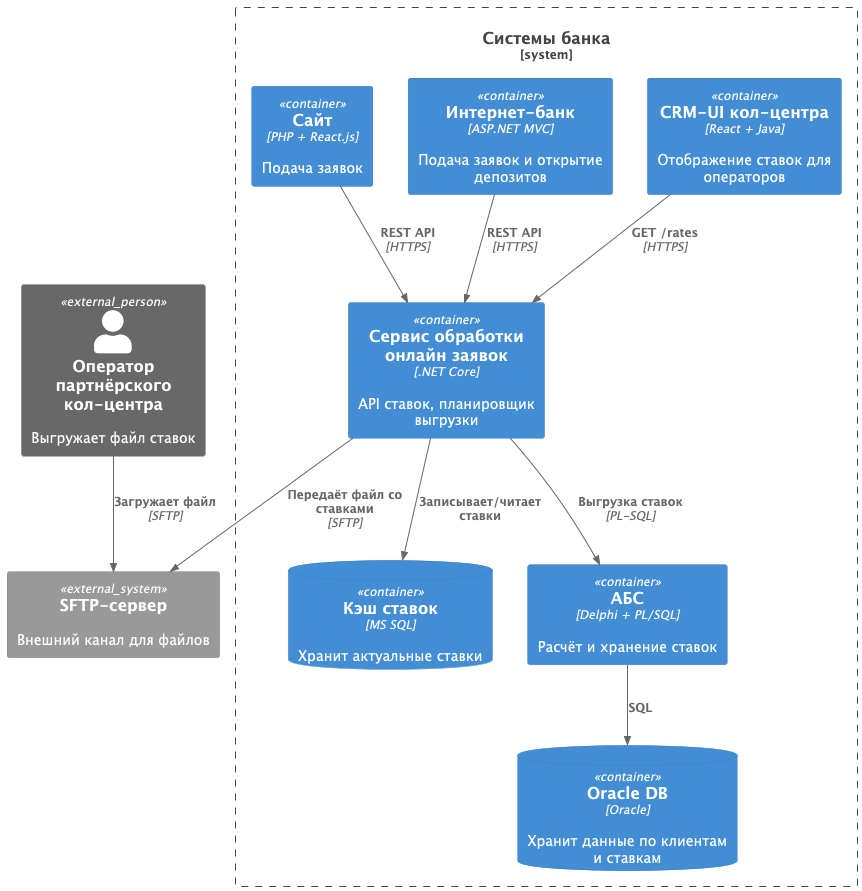
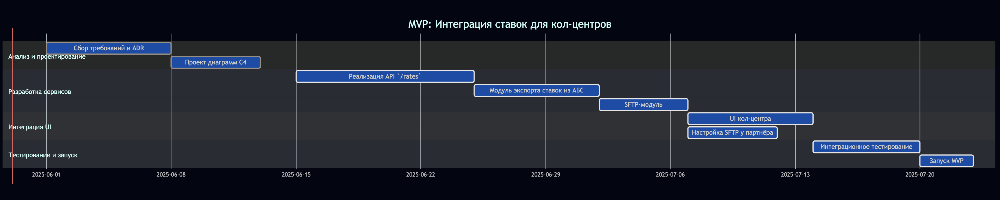

# ADR: Интеграция ставок в кол-центр и партнёрский кол-центр

### Название задачи
Передача ставок в кол-центр и партнёрский кол-центр

### Автор
Павел Бредихин

### Дата
2025-05-29

---

## Функциональные требования (Use Cases)

| № | Действующие лица или системы                           | Use Case                                    | Описание                                                                                    |
|:-:|--------------------------------------------------------|---------------------------------------------|---------------------------------------------------------------------------------------------|
| 1 | Оператор кол-центра -> Сервис обработки онлайн заявок  | Получить актуальные ставки для консультации | Оператор запрашивает список ставок через API сервиса и видит их в UI.                       |
| 2 | Сервис обработки онлайн заявок -> АБС                  | Экспорт актуальных ставок                   | Сервис обработки онлайн заявок по расписанию выгружает ставки из АБС и кэширует их для API. |
| 3 | Сервис обработки онлайн заявок -> SFTP Партнёрского СЦ | Генерация и передача файла со ставками      | По расписанию сервис формирует CSV/XML-файл и кладёт его на SFTP-путь партнёра.             |
| 5 | SFTP Партнёрского СЦ -> Оператор партнёрского СЦ       | Выгрузка актуальных ставок из SFTP сервера  | Оператор, с помощью SFTP-клиента, выгружает себе файл с актуальными ставками.               |

---

## Нефункциональные требования

| №  | Требование                                                 | Комментарий                                 |
|:--:|------------------------------------------------------------|---------------------------------------------|
| N1 | Файл ставок должен генерироваться каждый день              | Обеспечить свежесть данных для операторов   |
| N2 | Все соединения (API, SFTP) по TLS 1.2+                     | Защита персональных и коммерческих данных   |
| N3 | Время отклика API Сервиса обработки онлайн заявок ≤ 200 мс | Быстрое отображение ставок в UI кол-центра  |
| N4 | Доступность Сервиса обработки онлайн заявок 99,9 %         | Критично для беспрерывной работы кол-центра |
| N5 | Логирование всех операций выгрузки и загрузки ставок       | Аудит и расследование инцидентов            |

---

## Решение

Ниже приведены диаграммы контекста и контейнеров.

### Диаграмма контекста

### Диаграмма контейнеров

### Логика выбора технологий
- **Сервис обработки онлайн заявок** защищает АБС от прямой нагрузки и служит единой точкой согласования ставок.
- **Файловая выгрузка (SFTP)** выбрана из-за ограничений внешней системы партнёра.
- **Кэширование** в MS SQL снижает задержки при частых запросах от операторов.

---

## Альтернативы

1. **API-подписка / Webhook**  
   – Плюсы: мгновенное обновление, нет файлов.  
   – Минусы: партнёрская система не поддерживает HTTP-интеграцию.

2. **Использование Kafka + FTP-адаптер**  
   – Плюсы: надёжность, асинхронность.  
   – Минусы: требует доработки .NET-ядра интернет-банка, усилия по обучению.

---

## Недостатки, ограничения, риски

- SFTP-файл может устаревать, риск консультации по неактуальным ставкам.
- Нагрузка на Сервис обработки онлайн заявок при большом числе операторов-нужен горизонтальный скейлинг.
- Зависимость от внешней SFTP-инфраструктуры партнёра (высокая латентность или сбои).

---

## Крупные задачи по системе

| Система                        | Задачи                                                                                                       |
|--------------------------------|--------------------------------------------------------------------------------------------------------------|
| Сервис обработки онлайн заявок | - Реализовать REST API `/rates`;  - Планировщик экспорта ставок из АБС;  - Модуль SFTP-загрузки файлов |
| АБС                            | - Выделить таблицу ставок;   - Написать PL/SQL процедуру выгрузки в API                                   |
| Кол-центр банка (UI)           | - Добавить экран “Текущие ставки”;   - Интеграция с API `/rates`                                          |
| Партнёрский кол-центр          | - Настроить SFTP сервер;                                                                                     |

---

## Дорожная карта (6 мес.)
